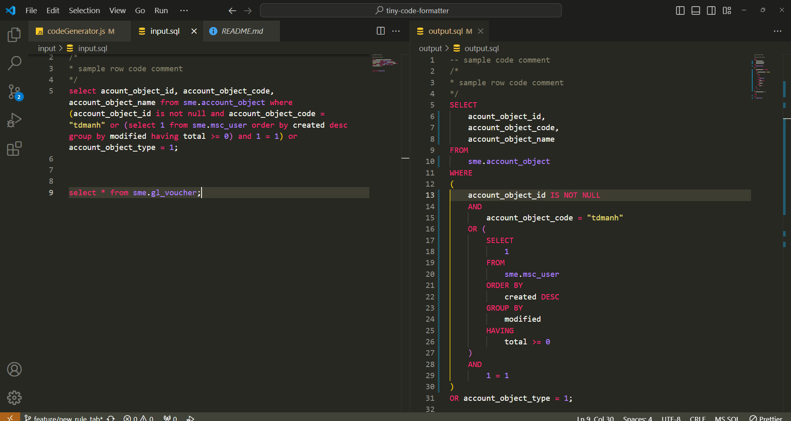
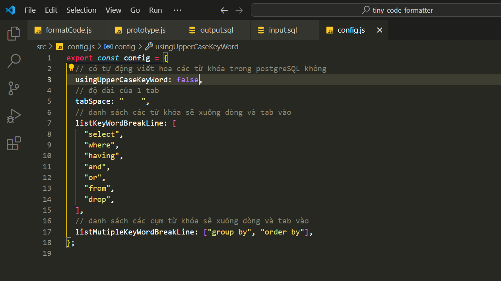

# project format code postgre sql đơn giản bằng nodejs

note: project này mới chỉ làm được việc đọc file sql thành các token và biến đổi thành cây ast cơ bản, việc xử lý từ cây ast về thành đoạn mã formatted mới chỉ đáp ứng được 1 số trường hợp cơ bản

todo: bổ sung token với text trong dấu '' thay vì ""
todo: bổ sung format code cho function lấy dữ liệu

demo việc format code

config các keyword trong postgresql mong muốn xuống dòng

